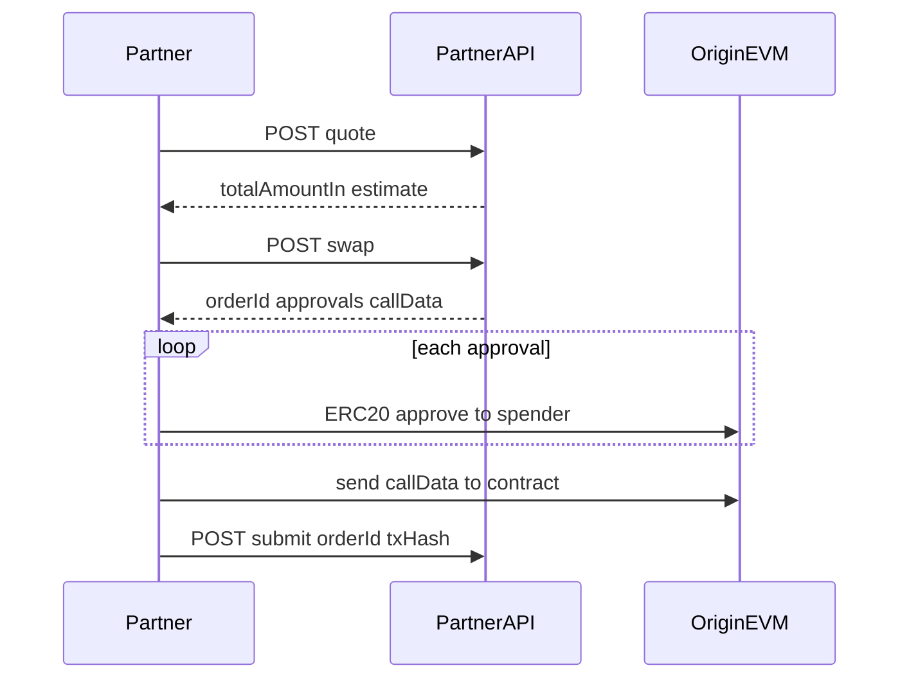

# Partner Batch API

Internal technical draft for BD. Not the final public developer docs (`/partner/docs`).

Partner API keys call the same batch payout flow as the product Batch Payout page: **quote → swap → on-chain approve / payout → submit**.

## Base URL and auth

| | |
| --- | --- |
| Production | `https://api.stableflow.ai` |
| Auth | `Authorization: Bearer {apiKey}` |
| Content type | `application/json` |

Create the API key in the product at `/partner/api-keys`. Call these endpoints from a **server**. Do not put the key in a browser or other client-side code.

## Envelope

Every response is:

```json
{ "code": 200, "data": {}, "message": "" }
```

- `code === 200` is success. Use `data`.
- Any other `code`, or a non-OK HTTP status, is an error. Read `message`. This draft does not enumerate error codes.

## Supported networks and tokens

`network` on the request **must** be the `blockchain` code (for example `arb`), not the display name (`Arbitrum`).

Tokens: **USDT** and **USDC** only, for both origin and destination.

### Payer (`network`)

Origin / paying chain. Only `payerEnabled` chains. All of them are EVM today.

| Code | Name | Chain ID |
| --- | --- | --- |
| `eth` | Ethereum | 1 |
| `base` | Base | 8453 |
| `arb` | Arbitrum | 42161 |
| `op` | Optimism | 10 |
| `pol` | Polygon | 137 |
| `bsc` | BNB Chain | 56 |
| `avax` | Avalanche | 43114 |
| `gnosis` | Gnosis | 100 |
| `monad` | Monad | 143 |
| `scroll` | Scroll | 534352 |
| `xlayer` | X Layer | 196 |
| `plasma` | Plasma | 9745 |
| `bera` | Berachain | 80094 |

`payer` and `refundTo` must be valid addresses on this origin chain.

### Recipients (`receives[].network`)

Destination chain. All registered chains, including non-EVM.

| Code | Name | Address kind |
| --- | --- | --- |
| `eth` | Ethereum | EVM (`0x` + 40 hex) |
| `base` | Base | EVM |
| `arb` | Arbitrum | EVM |
| `op` | Optimism | EVM |
| `pol` | Polygon | EVM |
| `bsc` | BNB Chain | EVM |
| `avax` | Avalanche | EVM |
| `gnosis` | Gnosis | EVM |
| `monad` | Monad | EVM |
| `scroll` | Scroll | EVM |
| `xlayer` | X Layer | EVM |
| `plasma` | Plasma | EVM |
| `bera` | Berachain | EVM |
| `near` | Near | Near account (2–64 chars) or 64-hex implicit |
| `sol` | Solana | Solana base58 |
| `tron` | Tron | Tron `T…` address |

`receives[].address` must match the address kind of `receives[].network`.

## Limits

Same constraints as the in-app batch payout.

| Field | Rule |
| --- | --- |
| `receives` | 1–100 rows |
| `receives[].amount` | Positive decimal string, max 6 fraction digits (example `"1"`, `"1.009585"`) |
| `receives[].memo` | Optional. Max 200 characters. Omit or send `""` when unused |
| `slippageTolerance` | Integer. **`5` means 0.05%** |
| `token` / `receives[].token` | `USDT` or `USDC` |
| `network` / `receives[].network` | `blockchain` code from the tables above |

## Amount units

| Field | Unit | Example |
| --- | --- | --- |
| `receives[].amount` (request) | Human-readable decimal | `"1"` |
| `totalAmountIn` (response) | Origin token smallest units (integer string) | `"1009585"` |
| `totalAmountInFormatted` | Human-readable origin amount | `"1.009585"` |
| `totalAmountInUsd` | USD estimate, human-readable | `"1.009585"` |

Compare wallet balance and ERC-20 allowance against `totalAmountIn` (as `bigint`), not the formatted strings.

## Integration flow



1. **Quote** — dry estimate. Same body as swap. `deadline` may be `""`.
2. **Swap** — creates the order. Returns `orderId`, `approvals`, `callData`, `spender`, `contract`, and a real `deadline`.
3. **On-chain (origin EVM only)**
   - For each non-empty string in `approvals`: send that calldata to the **origin ERC-20 token contract** (not `spender`). Wait for success.
   - Hex may omit the `0x` prefix. Prefix `0x` before broadcasting.
   - Then send `callData` to `contract` (`value = 0`). `spender` and `contract` are usually the same address.
4. **Submit** — `{ orderId, txHash }` where `txHash` is the **payout** transaction, not an approval tx.

Quote and swap share the same request body.

## Endpoints

### POST `/v1/pay/partner/batch/quote`

Estimate origin amount in. Does not create an order.

**Request body**

| Field | Type | Required | Notes |
| --- | --- | --- | --- |
| `network` | string | yes | Origin `blockchain` code. Payer-enabled only |
| `token` | string | yes | Origin token: `USDT` or `USDC` |
| `payer` | string | yes | Origin wallet that will pay |
| `refundTo` | string | yes | Refund address on the origin chain (typically same as `payer`) |
| `slippageTolerance` | number | yes | `5` = 0.05% |
| `receives` | array | yes | 1–100 recipients |
| `receives[].address` | string | yes | Destination wallet |
| `receives[].amount` | string | yes | Human-readable destination amount |
| `receives[].network` | string | yes | Destination `blockchain` code |
| `receives[].token` | string | yes | Destination token: `USDT` or `USDC` |
| `receives[].memo` | string | no | Max 200 chars; private to the partner |

**Request example**

```json
{
  "network": "arb",
  "payer": "0x635fa4477c7f9681a4ac88fa6147f441114e8655",
  "receives": [
    {
      "address": "0x635fa4477c7f9681a4ac88fa6147f441114e8655",
      "amount": "1",
      "memo": "",
      "network": "bsc",
      "token": "USDT"
    }
  ],
  "refundTo": "0x635fa4477c7f9681a4ac88fa6147f441114e8655",
  "slippageTolerance": 5,
  "token": "USDT"
}
```

**Response `data`**

| Field | Type | Notes |
| --- | --- | --- |
| `totalAmountIn` | string | Origin amount in smallest units |
| `totalAmountInUsd` | string | USD estimate |
| `totalAmountInFormatted` | string | Human-readable origin amount |
| `deadline` | string | May be `""` on quote |

**Response example**

```json
{
  "code": 200,
  "data": {
    "totalAmountIn": "1009585",
    "totalAmountInUsd": "1.009585",
    "totalAmountInFormatted": "1.009585",
    "deadline": ""
  }
}
```

### POST `/v1/pay/partner/batch/swap`

Creates the order and returns calldata to broadcast on the origin chain.

**Request body** — same as quote.

**Response `data`** — quote fields plus:

| Field | Type | Notes |
| --- | --- | --- |
| `deadline` | string | ISO timestamp; order expires after this |
| `orderId` | string | Pass this to submit |
| `approvals` | string[] | ERC-20 `approve` calldata. Send each to the origin token contract. May be empty if already approved. Hex may lack `0x` |
| `callData` | string | Payout calldata. Send to `contract`. Hex may lack `0x` |
| `spender` | string | Address that must receive the ERC-20 allowance |
| `contract` | string | Payout contract. `to` for the payout transaction |

**Response example**

```json
{
  "code": 200,
  "data": {
    "totalAmountIn": "1009585",
    "totalAmountInUsd": "1.009585",
    "totalAmountInFormatted": "1.009585",
    "deadline": "2026-08-29T03:41:20.462Z",
    "orderId": "ca38f610b3c8443a9a6343bd57e337a6",
    "approvals": [
      "095ea7b30000000000000000000000002684a89afe1e4e419c627fc2bfeb6edbae0f767300000000000000000000000000000000000000000000000000000000000f67b1"
    ],
    "callData": "87845f2a000000000000000000000000fd086bc7cd5c481dcc9c85ebe478a1c0b69fcbb9000000000000000000000000000000000000000000000000000000000000008000000000000000000000000000000000000000000000000000000000000000c000000000000000000000000000000000ca38f610b3c8443a9a6343bd57e337a60000000000000000000000000000000000000000000000000000000000000001000000000000000000000000e06101ed1156bc6c62c56ae509ed0a8dda04f01d000000000000000000000000000000000000000000000000000000000000000100000000000000000000000000000000000000000000000000000000000f67b1",
    "spender": "0x2684A89AFE1E4E419C627Fc2bFEb6EDBAe0F7673",
    "contract": "0x2684A89AFE1E4E419C627Fc2bFEb6EDBAe0F7673"
  }
}
```

### POST `/v1/pay/partner/batch/submit`

Report the origin payout transaction after it is broadcast.

**Request body**

| Field | Type | Required | Notes |
| --- | --- | --- | --- |
| `orderId` | string | yes | From swap |
| `txHash` | string | yes | Origin **payout** tx hash (not an approval tx) |

**Request example**

```json
{
  "orderId": "ca38f610b3c8443a9a6343bd57e337a6",
  "txHash": "0x…"
}
```

**Response** — `code: 200`. `data` is empty / unused.

## On-chain notes

- Origin broadcast is **EVM-only** (all payer-enabled chains).
- Recipients may be EVM, Near, Solana, or Tron; the partner only signs on the origin chain.
- `approvals[]` selector `095ea7b3` is ERC-20 `approve(spender, amount)`. `amount` matches `totalAmountIn`.
- Confirm origin token balance `>= totalAmountIn` before sending the payout tx.
- Submit only the payout `txHash`. Retry submit on transient failure; do not swap a second time for the same intended payment unless the previous order expired.

## curl

Replace `$API_KEY` and the payout `txHash`.

```bash
# Quote
curl -sS https://api.stableflow.ai/v1/pay/partner/batch/quote \
  -H "Authorization: Bearer $API_KEY" \
  -H "Content-Type: application/json" \
  -d '{
    "network": "arb",
    "payer": "0x635fa4477c7f9681a4ac88fa6147f441114e8655",
    "receives": [
      {
        "address": "0x635fa4477c7f9681a4ac88fa6147f441114e8655",
        "amount": "1",
        "memo": "",
        "network": "bsc",
        "token": "USDT"
      }
    ],
    "refundTo": "0x635fa4477c7f9681a4ac88fa6147f441114e8655",
    "slippageTolerance": 5,
    "token": "USDT"
  }'
```

```bash
# Swap (same body as quote)
curl -sS https://api.stableflow.ai/v1/pay/partner/batch/swap \
  -H "Authorization: Bearer $API_KEY" \
  -H "Content-Type: application/json" \
  -d '{
    "network": "arb",
    "payer": "0x635fa4477c7f9681a4ac88fa6147f441114e8655",
    "receives": [
      {
        "address": "0x635fa4477c7f9681a4ac88fa6147f441114e8655",
        "amount": "1",
        "memo": "",
        "network": "bsc",
        "token": "USDT"
      }
    ],
    "refundTo": "0x635fa4477c7f9681a4ac88fa6147f441114e8655",
    "slippageTolerance": 5,
    "token": "USDT"
  }'
```

```bash
# Submit (txHash is the payout transaction, after approvals + callData)
curl -sS https://api.stableflow.ai/v1/pay/partner/batch/submit \
  -H "Authorization: Bearer $API_KEY" \
  -H "Content-Type: application/json" \
  -d '{
    "orderId": "ca38f610b3c8443a9a6343bd57e337a6",
    "txHash": "0x0000000000000000000000000000000000000000000000000000000000000000"
  }'
```
